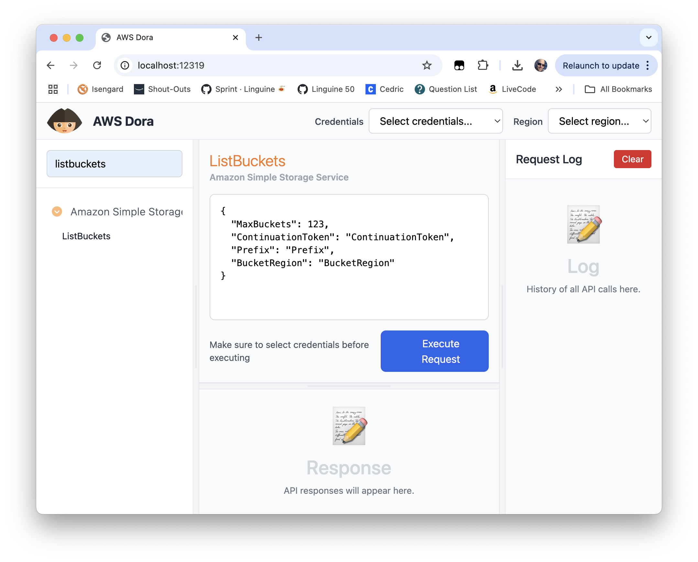

# AWS Dora

A web-based tool for exploring and testing AWS APIs with a user-friendly interface.



## Usage

```sh
$ npx aws-dora

# Then open http://localhost:12319/
```

Or over an SSH tunnel

```sh
$ ssh -L 12319:localhost:12319 user@remote-server npx aws-dora

# Then open http://localhost:12319/
```
## License

MIT License - see LICENSE file for details.
